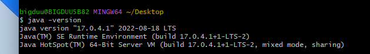
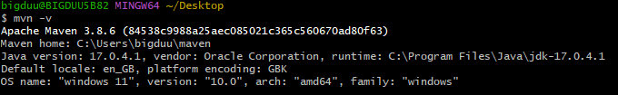
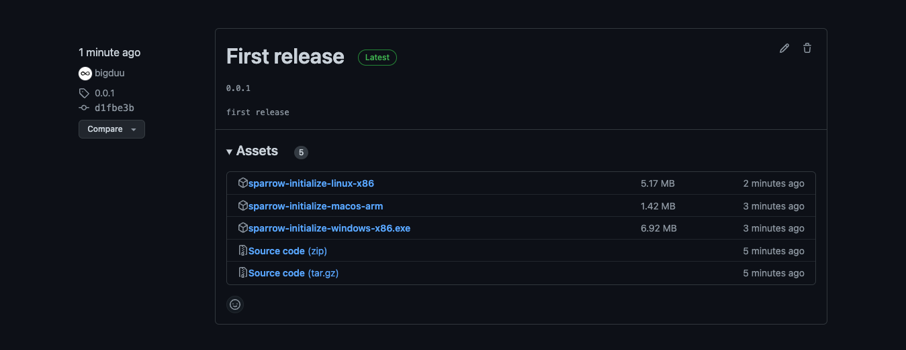

# A Sparrow-os project initialize program

> The program want to help the people that no experience on developer to set up the sparrow-os local develop
> environment

## There are some work you need paper before you run the tool

1. make sure Git tools has been installed in you local environment

`git -v`
> 

2. make sure JDK has been installed in you machine and has set the environment variables

`java -version`
> 

3. make sure Maven has been installed in you machine and has set the environment variables  
   `mvn -v`

> 

## Then you can set up now!

1. Select a binary program to download [click me](https://github.com/bigduu/sparrow-initialize/releases)

2. run the tools
>